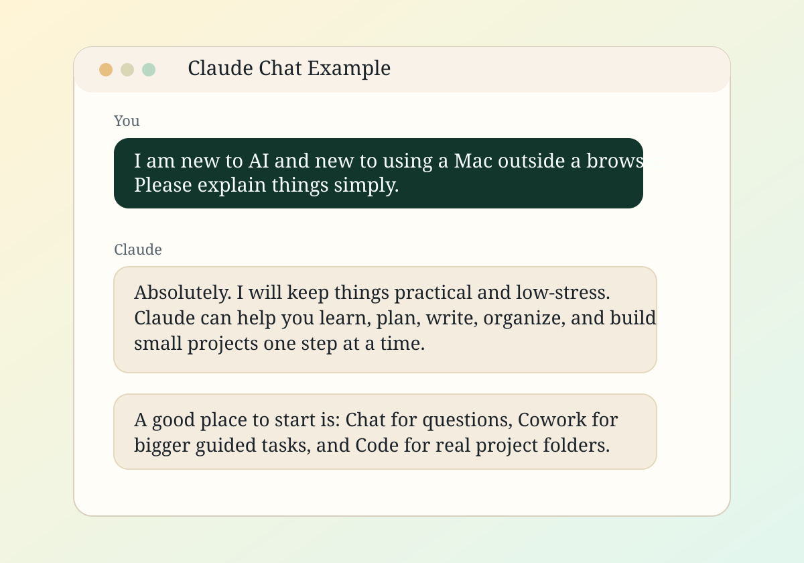
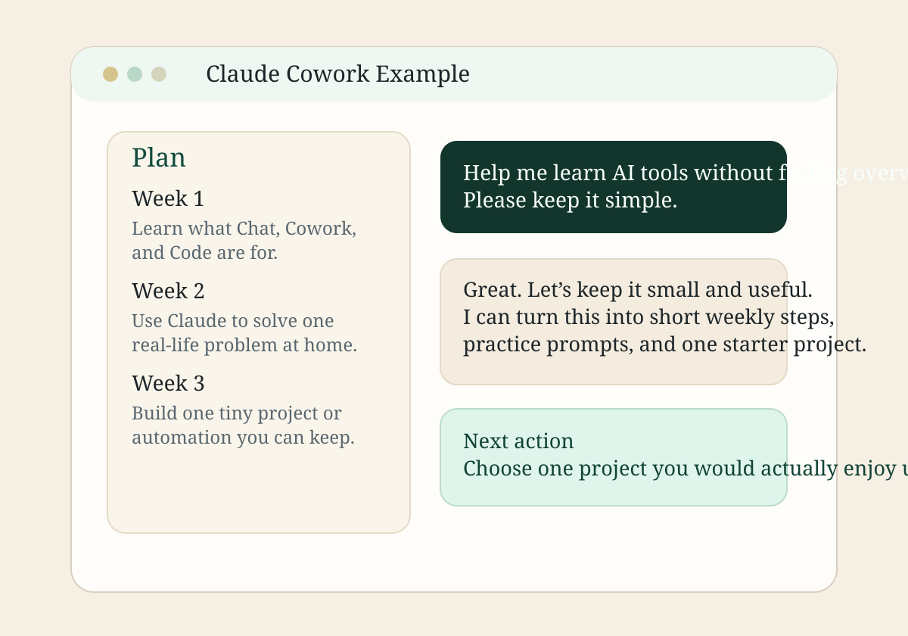
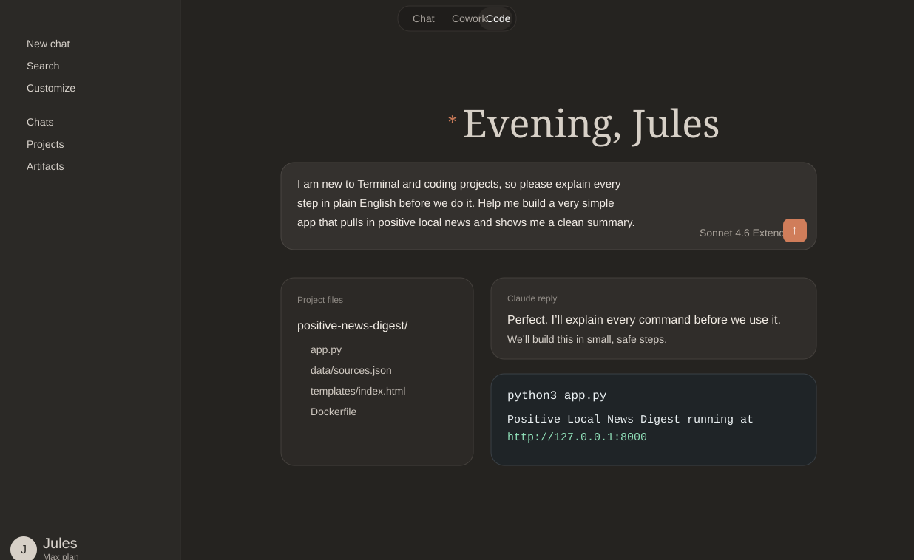

# Your First 10 Minutes With Claude

This guide is for someone who wants to see what using Claude actually looks like, not just read vague advice written by people who have clearly been living in Terminal since 2009.

If you prefer a more visual version, open:

- [docs/first-10-minutes.html](first-10-minutes.html)

## What You Will Learn

In your first 10 minutes, you can learn:

- what `Chat` feels like
- when to use `Cowork`
- what `Code` is for
- what kind of questions actually work well without sounding robotic

## Minute 1 To 3: Start With Chat

`Chat` is the easiest place to begin because it feels the most natural.

Try a prompt like this:

```text
Hi Claude. Help me learn what I can actually do with you.
I am new to AI and want to learn the basics, but please keep it simple,
practical, and not overly technical.
```

Visual example:



Why this works:

- it tells Claude your experience level
- it asks for normal-people language
- it gives a clear goal without overcomplicating it

## Minute 4 To 6: Try Cowork

Use `Cowork` when the task is bigger and you want structure.

Try a prompt like this:

```text
Help me make a realistic plan to learn Claude without getting overwhelmed.
I want small steps, plain English, and examples that fit real life,
not pretend productivity superhero stuff.
```

Visual example:



Good uses for Cowork:

- planning a project
- comparing options
- organizing a bigger life task
- learning something over time without getting smoked in week one

## Minute 7 To 10: Try Code

Use `Code` when Claude is helping inside a real folder or project.

One important thing first:

- open the project folder in Claude Code before you paste a Code prompt
- that is how Claude knows which files and app you mean
- you do not need a special Skill or integration for a basic beginner project

If you are unsure whether Claude is looking at the right place, say:

```text
Before we start, please tell me what folder and files you can currently see.
```

Try a prompt like this:

```text
You are looking at my current project folder.
I am new to Terminal and coding projects, so please explain every step
in plain English before we do it.
Help me build a very simple app that pulls in positive local news and
shows me a clean summary.
```

Visual example:



Good uses for Code:

- building a small tool
- fixing an error
- explaining a command
- editing files safely without feeling like one typo will end civilization

## Three Prompts You Can Reuse

`Beginner mode`

```text
Please explain this as if I am smart but new to this.
Use simple language and show me one step at a time.
Do not skip the obvious bits.
```

`Show me what good looks like`

```text
Show me a solid example prompt, the kind of answer I should expect,
and why that prompt works.
```

`Help me stay calm`

```text
If something could break or confuse me, tell me before we do it.
Flag the risky part first, then show me the safe next step.
```

## Best Habit To Build Early

Tell Claude your level of experience right at the start.

That one small habit makes the answers way more useful.

## If You Want To Add Real Screenshots Later

The visuals in this guide are custom mockups based on a real Claude screen layout. You can later swap them for real screenshots from the Mac app while keeping the same guide structure.
